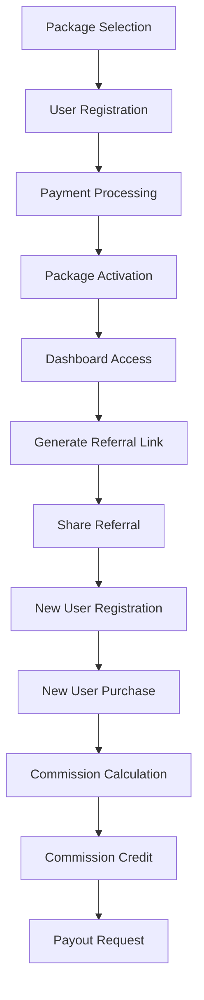

# Affiliate Marketing Package System - Product Requirements Document

## 1. Product Overview

This is an affiliate video learning platform that combines educational content with a multi-level marketing system. Users purchase one of three packages (Silver, Gold, Platinum) and earn commissions by referring others, creating a sustainable revenue model with direct and indirect commission structures.

- The system enables users to earn money through referrals while accessing educational content, solving the problem of monetizing learning platforms.
- Target market: Individuals seeking both educational content and income opportunities through affiliate marketing.

## 2. Core Features

### 2.1 User Roles

| Role | Registration Method | Core Permissions |
|------|---------------------|------------------|
| Regular User | Email registration + Package purchase | Can purchase packages, refer others, earn commissions, access content |
| Admin | Admin invitation | Can manage packages, view all transactions, manage users, configure commission rates |

### 2.2 Feature Module

Our affiliate marketing platform consists of the following main pages:

1. **Package Selection Page**: Display three packages with pricing, package comparison, purchase options.
2. **Dashboard Page**: User profile, referral statistics, commission earnings, referral link generation.
3. **Purchase Page**: Payment processing, package selection confirmation, transaction completion.
4. **Referral Management Page**: Referral link sharing, referral tree visualization, commission tracking.
5. **Commission History Page**: Earnings breakdown, payout requests, transaction history.
6. **Admin Panel**: Package management, user management, commission configuration, system analytics.

### 2.3 Page Details

| Page Name | Module Name | Feature description |
|-----------|-------------|---------------------|
| Package Selection | Package Display | Show three packages (Silver ₹2,950, Gold ₹5,310, Platinum ₹8,850) with features and benefits |
| Package Selection | Package Comparison | Side-by-side comparison of package features and commission potential |
| Package Selection | Purchase CTA | Clear purchase buttons leading to payment flow |
| Dashboard | User Profile | Display current package, referral code, earnings summary |
| Dashboard | Referral Statistics | Show direct/indirect referrals count, conversion rates |
| Dashboard | Commission Overview | Total earnings, pending commissions, available for withdrawal |
| Dashboard | Referral Link Generator | Generate and copy personalized referral links |
| Purchase Page | Package Selection | Confirm selected package with pricing breakdown including GST |
| Purchase Page | Payment Gateway | Integrate Razorpay for secure payment processing |
| Purchase Page | Transaction Confirmation | Order confirmation with package activation |
| Referral Management | Referral Tree | Visual representation of referral hierarchy (2 levels) |
| Referral Management | Link Sharing | Social media sharing, WhatsApp integration, email sharing |
| Referral Management | Performance Tracking | Track clicks, conversions, earnings per referral |
| Commission History | Earnings Breakdown | Separate direct and indirect commission earnings |
| Commission History | Payout Management | Request withdrawals, view payout history, payment methods |
| Commission History | Transaction Details | Detailed view of each commission transaction |
| Admin Panel | Package Management | Create, edit, disable packages and pricing |
| Admin Panel | User Management | View all users, their packages, referral trees |
| Admin Panel | Commission Configuration | Set commission rates, manage payout rules |
| Admin Panel | Analytics Dashboard | System-wide statistics, revenue reports, user growth |

## 3. Core Process

### User Registration and Package Purchase Flow
1. User visits platform and views package options
2. User selects desired package (Silver/Gold/Platinum)
3. User completes registration with email and basic details
4. User proceeds to payment gateway for package purchase
5. Upon successful payment, user account is activated with selected package
6. User receives referral link and access to dashboard

### Referral and Commission Flow
1. User shares referral link through various channels
2. New user clicks referral link and registers
3. New user purchases a package
4. System calculates and credits direct commission to referrer
5. If referrer was also referred, system calculates indirect commission for level-2 referrer
6. Commissions are tracked and made available for withdrawal

## 4. User Interface Design

### 4.1 Design Style

- **Primary Colors**: Deep blue (#1e40af) for trust and professionalism, Gold (#f59e0b) for premium feel
- **Secondary Colors**: Light gray (#f3f4f6) for backgrounds, Green (#10b981) for success states
- **Button Style**: Rounded corners (8px), gradient backgrounds for CTAs, solid colors for secondary actions
- **Font**: Inter or Poppins for modern, clean readability with sizes 14px (body), 18px (headings), 24px (titles)
- **Layout Style**: Card-based design with clean spacing, top navigation with user avatar, sidebar for dashboard navigation
- **Icons**: Feather icons for consistency, money/commission icons, sharing icons for social media

### 4.2 Page Design Overview

| Page Name | Module Name | UI Elements |
|-----------|-------------|-------------|
| Package Selection | Package Cards | Three prominent cards with pricing, features list, "Choose Package" buttons in gradient colors |
| Package Selection | Comparison Table | Responsive table with checkmarks, highlighting differences between packages |
| Dashboard | Stats Cards | Four cards showing total earnings, referrals, pending commissions, package level |
| Dashboard | Referral Link | Copy-to-clipboard input field with share buttons for WhatsApp, Telegram, Email |
| Purchase Page | Payment Form | Clean form with package summary, GST breakdown, secure payment badges |
| Referral Management | Tree Visualization | Interactive tree diagram showing referral hierarchy with user avatars and earnings |
| Commission History | Earnings Table | Sortable table with date, type (direct/indirect), amount, status columns |
| Admin Panel | Analytics Charts | Bar charts for revenue, line charts for user growth, pie charts for package distribution |

### 4.3 Responsiveness

The platform is mobile-first with responsive design optimized for touch interactions. Package cards stack vertically on mobile, dashboard uses collapsible sidebar, and referral tree adapts to smaller screens with horizontal scrolling.

## 5. Package and Commission Specifications

### 5.1 Package Pricing Structure

| Package | Base Price | GST (18%) | Final Price |
|---------|------------|-----------|-------------|
| Silver | ₹2,500 | ₹450 | **₹2,950** |
| Gold | ₹4,500 | ₹810 | **₹5,310** |
| Platinum | ₹7,500 | ₹1,350 | **₹8,850** |

### 5.2 Commission Matrix

#### Direct Commission (Level 1)

| User Package | Silver Referral | Gold Referral | Platinum Referral |
|--------------|----------------|---------------|-------------------|
| Silver | ₹1,875 | ₹2,375 | ₹2,875 |
| Gold | ₹1,875 | ₹3,375 | ₹3,875 |
| Platinum | ₹1,875 | ₹3,375 | ₹5,625 |

#### Indirect Commission (Level 2)

| User Package | Silver Referral | Gold Referral | Platinum Referral |
|--------------|----------------|---------------|-------------------|
| Silver | ₹150 | ₹350 | ₹400 |
| Gold | ₹200 | ₹400 | ₹600 |
| Platinum | ₹200 | ₹500 | ₹1,000 |

### 5.3 Business Rules

1. **Commission Eligibility**: Users must have an active package to earn commissions
2. **Payout Threshold**: Minimum ₹500 for withdrawal requests
3. **Commission Timing**: Commissions are credited within 24 hours of successful referral purchase
4. **Referral Validity**: Referral links remain active as long as the referrer maintains an active package
5. **Level Limitation**: Commission structure is limited to 2 levels (direct and indirect)
6. **Package Upgrades**: Users can upgrade packages, with commission rates updating immediately

## 6. Success Metrics

- **User Acquisition**: Monthly new registrations and package purchases
- **Referral Performance**: Conversion rate from referral clicks to purchases
- **Revenue Growth**: Monthly recurring revenue from package sales
- **Commission Distribution**: Total commissions paid vs. revenue generated
- **User Retention**: Active users maintaining packages month-over-month
- **Average Revenue Per User (ARPU)**: Revenue per active user including referral earnings