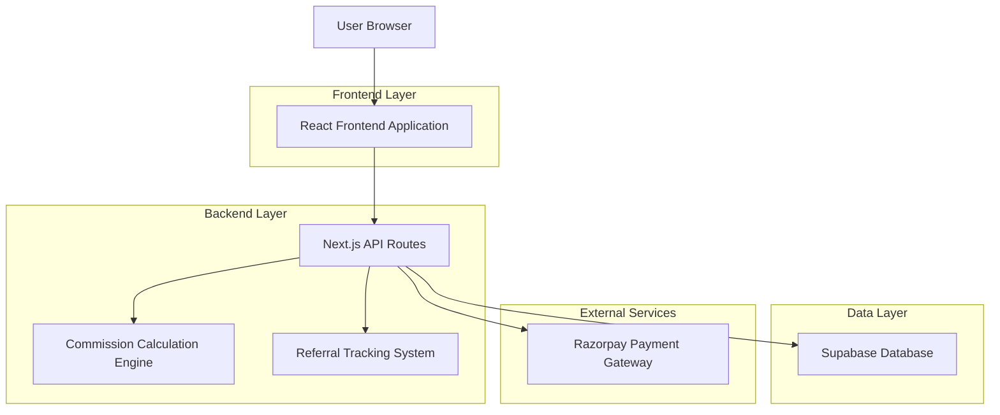
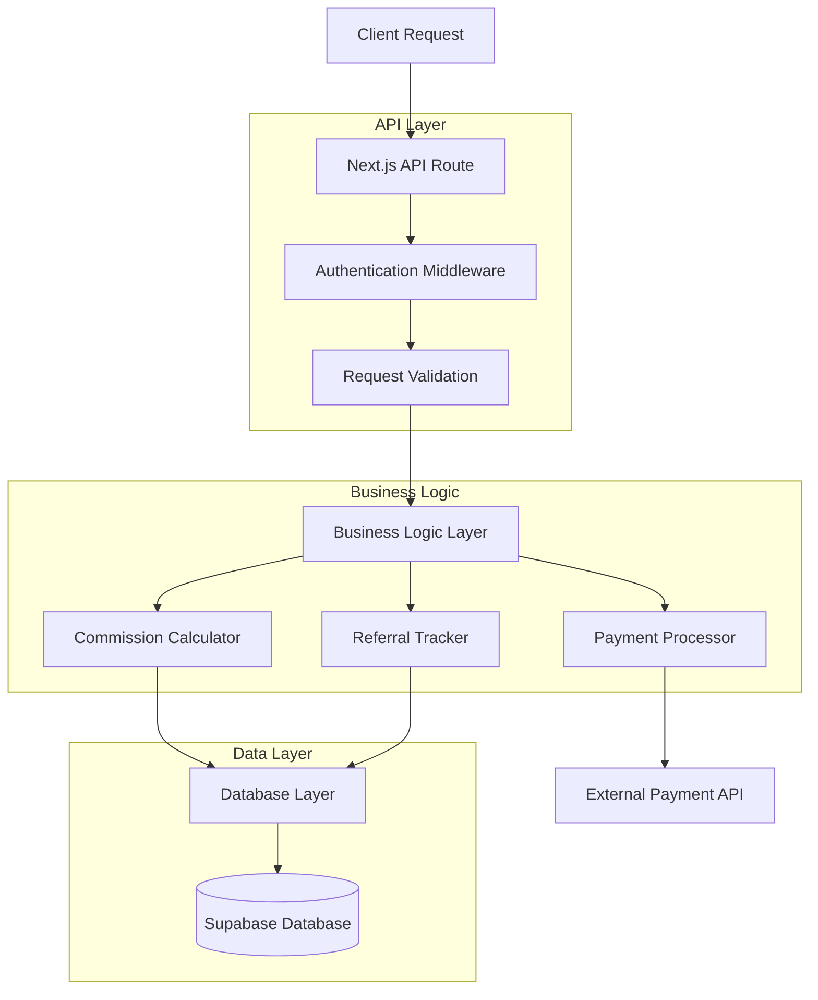
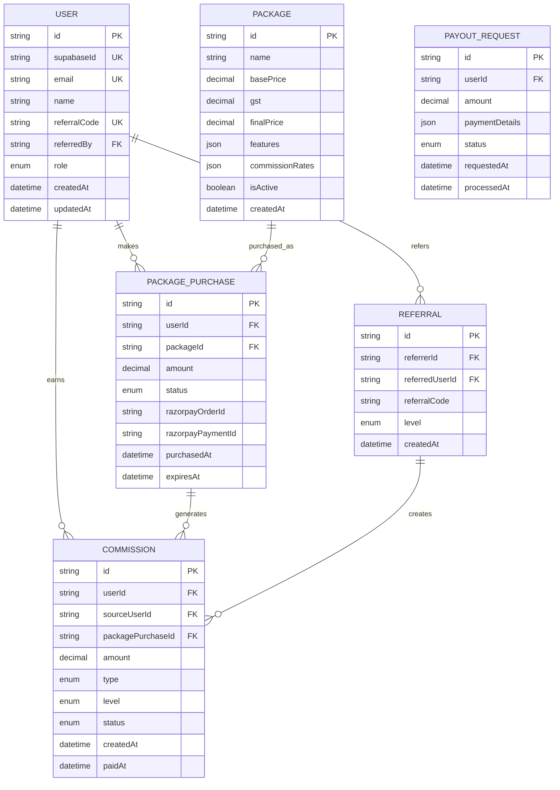

# Affiliate Package System - Technical Architecture Document

## 1. Architecture Design



## 2. Technology Description

- Frontend: React@18 + Next.js@14 + TailwindCSS@3 + TypeScript
- Backend: Next.js API Routes + Prisma ORM
- Database: Supabase (PostgreSQL)
- Payment: Razorpay Integration
- Authentication: Supabase Auth

## 3. Route Definitions

| Route | Purpose |
|-------|----------|
| / | Landing page with package overview and selection |
| /packages | Detailed package comparison and selection |
| /purchase/[packageId] | Package purchase flow with payment integration |
| /dashboard | User dashboard with referral stats and earnings |
| /referrals | Referral management and tree visualization |
| /commissions | Commission history and payout requests |
| /admin | Admin panel for package and user management |
| /auth/login | User authentication |
| /auth/register | User registration with referral tracking |

## 4. API Definitions

### 4.1 Package Management APIs

**Get all packages**
```
GET /api/packages
```

Response:
| Param Name | Param Type | Description |
|------------|------------|-------------|
| packages | Package[] | Array of available packages |
| success | boolean | Request status |

Example:
```json
{
  "success": true,
  "packages": [
    {
      "id": "silver",
      "name": "Silver",
      "basePrice": 2500,
      "gst": 450,
      "finalPrice": 2950,
      "features": ["Basic Content Access", "Referral System"],
      "isActive": true
    }
  ]
}
```

**Purchase package**
```
POST /api/packages/purchase
```

Request:
| Param Name | Param Type | isRequired | Description |
|------------|------------|------------|-------------|
| packageId | string | true | Package identifier (silver/gold/platinum) |
| paymentMethod | string | true | Payment method (razorpay) |
| referralCode | string | false | Referrer's code if applicable |

Response:
| Param Name | Param Type | Description |
|------------|------------|-------------|
| success | boolean | Purchase status |
| orderId | string | Razorpay order ID |
| amount | number | Total amount to pay |

### 4.2 Referral System APIs

**Generate referral link**
```
POST /api/referrals/generate
```

Response:
| Param Name | Param Type | Description |
|------------|------------|-------------|
| referralCode | string | Unique referral code |
| referralLink | string | Complete referral URL |

**Get referral statistics**
```
GET /api/referrals/stats
```

Response:
| Param Name | Param Type | Description |
|------------|------------|-------------|
| directReferrals | number | Count of direct referrals |
| indirectReferrals | number | Count of indirect referrals |
| totalEarnings | number | Total commission earned |
| pendingCommissions | number | Pending commission amount |

### 4.3 Commission APIs

**Get commission history**
```
GET /api/commissions/history
```

Response:
| Param Name | Param Type | Description |
|------------|------------|-------------|
| commissions | Commission[] | Array of commission records |
| totalEarnings | number | Total earnings to date |

**Request payout**
```
POST /api/commissions/payout
```

Request:
| Param Name | Param Type | isRequired | Description |
|------------|------------|------------|-------------|
| amount | number | true | Amount to withdraw |
| paymentMethod | string | true | Bank/UPI details |

## 5. Server Architecture Diagram



## 6. Data Model

### 6.1 Data Model Definition



### 6.2 Data Definition Language

**Users Table**
```sql
CREATE TABLE users (
    id UUID PRIMARY KEY DEFAULT gen_random_uuid(),
    supabase_id UUID UNIQUE NOT NULL,
    email VARCHAR(255) UNIQUE NOT NULL,
    name VARCHAR(100) NOT NULL,
    referral_code VARCHAR(20) UNIQUE NOT NULL,
    referred_by VARCHAR(20),
    role VARCHAR(20) DEFAULT 'USER' CHECK (role IN ('USER', 'ADMIN')),
    created_at TIMESTAMP WITH TIME ZONE DEFAULT NOW(),
    updated_at TIMESTAMP WITH TIME ZONE DEFAULT NOW()
);

CREATE INDEX idx_users_referral_code ON users(referral_code);
CREATE INDEX idx_users_referred_by ON users(referred_by);
```

**Packages Table**
```sql
CREATE TABLE packages (
    id VARCHAR(20) PRIMARY KEY,
    name VARCHAR(50) NOT NULL,
    base_price DECIMAL(10,2) NOT NULL,
    gst DECIMAL(10,2) NOT NULL,
    final_price DECIMAL(10,2) NOT NULL,
    features JSONB NOT NULL,
    commission_rates JSONB NOT NULL,
    is_active BOOLEAN DEFAULT true,
    created_at TIMESTAMP WITH TIME ZONE DEFAULT NOW()
);

-- Insert initial packages
INSERT INTO packages (id, name, base_price, gst, final_price, features, commission_rates) VALUES
('silver', 'Silver', 2500.00, 450.00, 2950.00, 
 '["Basic Content Access", "Referral System", "Community Access"]',
 '{"direct": {"silver": 1875, "gold": 2375, "platinum": 2875}, "indirect": {"silver": 150, "gold": 350, "platinum": 400}}'),
('gold', 'Gold', 4500.00, 810.00, 5310.00,
 '["Premium Content Access", "Advanced Referral System", "Priority Support", "Exclusive Webinars"]',
 '{"direct": {"silver": 1875, "gold": 3375, "platinum": 3875}, "indirect": {"silver": 200, "gold": 400, "platinum": 600}}'),
('platinum', 'Platinum', 7500.00, 1350.00, 8850.00,
 '["Full Content Access", "Maximum Referral Earnings", "1-on-1 Mentoring", "Business Tools", "Certification"]',
 '{"direct": {"silver": 1875, "gold": 3375, "platinum": 5625}, "indirect": {"silver": 200, "gold": 500, "platinum": 1000}}');
```

**Package Purchases Table**
```sql
CREATE TABLE package_purchases (
    id UUID PRIMARY KEY DEFAULT gen_random_uuid(),
    user_id UUID NOT NULL REFERENCES users(id),
    package_id VARCHAR(20) NOT NULL REFERENCES packages(id),
    amount DECIMAL(10,2) NOT NULL,
    status VARCHAR(20) DEFAULT 'PENDING' CHECK (status IN ('PENDING', 'SUCCESS', 'FAILED', 'REFUNDED')),
    razorpay_order_id VARCHAR(100),
    razorpay_payment_id VARCHAR(100),
    purchased_at TIMESTAMP WITH TIME ZONE DEFAULT NOW(),
    expires_at TIMESTAMP WITH TIME ZONE,
    created_at TIMESTAMP WITH TIME ZONE DEFAULT NOW()
);

CREATE INDEX idx_package_purchases_user_id ON package_purchases(user_id);
CREATE INDEX idx_package_purchases_status ON package_purchases(status);
```

**Referrals Table**
```sql
CREATE TABLE referrals (
    id UUID PRIMARY KEY DEFAULT gen_random_uuid(),
    referrer_id UUID NOT NULL REFERENCES users(id),
    referred_user_id UUID NOT NULL REFERENCES users(id),
    referral_code VARCHAR(20) NOT NULL,
    level INTEGER NOT NULL CHECK (level IN (1, 2)),
    created_at TIMESTAMP WITH TIME ZONE DEFAULT NOW()
);

CREATE INDEX idx_referrals_referrer_id ON referrals(referrer_id);
CREATE INDEX idx_referrals_referred_user_id ON referrals(referred_user_id);
CREATE UNIQUE INDEX idx_referrals_unique ON referrals(referrer_id, referred_user_id);
```

**Commissions Table**
```sql
CREATE TABLE commissions (
    id UUID PRIMARY KEY DEFAULT gen_random_uuid(),
    user_id UUID NOT NULL REFERENCES users(id),
    source_user_id UUID NOT NULL REFERENCES users(id),
    package_purchase_id UUID NOT NULL REFERENCES package_purchases(id),
    amount DECIMAL(10,2) NOT NULL,
    type VARCHAR(20) NOT NULL CHECK (type IN ('DIRECT', 'INDIRECT')),
    level INTEGER NOT NULL CHECK (level IN (1, 2)),
    status VARCHAR(20) DEFAULT 'PENDING' CHECK (status IN ('PENDING', 'APPROVED', 'PAID')),
    created_at TIMESTAMP WITH TIME ZONE DEFAULT NOW(),
    paid_at TIMESTAMP WITH TIME ZONE
);

CREATE INDEX idx_commissions_user_id ON commissions(user_id);
CREATE INDEX idx_commissions_status ON commissions(status);
CREATE INDEX idx_commissions_created_at ON commissions(created_at DESC);
```

**Payout Requests Table**
```sql
CREATE TABLE payout_requests (
    id UUID PRIMARY KEY DEFAULT gen_random_uuid(),
    user_id UUID NOT NULL REFERENCES users(id),
    amount DECIMAL(10,2) NOT NULL,
    payment_details JSONB NOT NULL,
    status VARCHAR(20) DEFAULT 'PENDING' CHECK (status IN ('PENDING', 'PROCESSING', 'COMPLETED', 'REJECTED')),
    requested_at TIMESTAMP WITH TIME ZONE DEFAULT NOW(),
    processed_at TIMESTAMP WITH TIME ZONE
);

CREATE INDEX idx_payout_requests_user_id ON payout_requests(user_id);
CREATE INDEX idx_payout_requests_status ON payout_requests(status);
```

**Database Permissions**
```sql
-- Grant permissions for authenticated users
GRANT SELECT ON packages TO authenticated;
GRANT ALL PRIVILEGES ON users TO authenticated;
GRANT ALL PRIVILEGES ON package_purchases TO authenticated;
GRANT ALL PRIVILEGES ON referrals TO authenticated;
GRANT ALL PRIVILEGES ON commissions TO authenticated;
GRANT ALL PRIVILEGES ON payout_requests TO authenticated;

-- Grant basic read access to anonymous users for packages
GRANT SELECT ON packages TO anon;
```

## 7. Commission Calculation Logic

### 7.1 Commission Calculation Function

```typescript
interface CommissionCalculation {
  directCommission: number;
  indirectCommission: number;
  referrerId: string;
  level2ReferrerId?: string;
}

function calculateCommissions(
  purchaserPackage: string,
  referrerPackage: string,
  level2ReferrerPackage?: string
): CommissionCalculation {
  const commissionRates = {
    silver: {
      direct: { silver: 1875, gold: 2375, platinum: 2875 },
      indirect: { silver: 150, gold: 350, platinum: 400 }
    },
    gold: {
      direct: { silver: 1875, gold: 3375, platinum: 3875 },
      indirect: { silver: 200, gold: 400, platinum: 600 }
    },
    platinum: {
      direct: { silver: 1875, gold: 3375, platinum: 5625 },
      indirect: { silver: 200, gold: 500, platinum: 1000 }
    }
  };

  const directCommission = commissionRates[referrerPackage]?.direct[purchaserPackage] || 0;
  const indirectCommission = level2ReferrerPackage 
    ? commissionRates[level2ReferrerPackage]?.indirect[purchaserPackage] || 0
    : 0;

  return {
    directCommission,
    indirectCommission,
    referrerId,
    level2ReferrerId
  };
}
```

### 7.2 Business Rules Implementation

1. **Commission Eligibility**: Verify referrer has active package before calculating commissions
2. **Automatic Commission Credit**: Trigger commission calculation on successful package purchase
3. **Two-Level Limitation**: Ensure commission calculation stops at level 2
4. **Package Upgrade Handling**: Update commission rates when user upgrades package
5. **Payout Threshold**: Enforce minimum ₹500 withdrawal limit
6. **Commission Approval**: Implement approval workflow for commission payouts